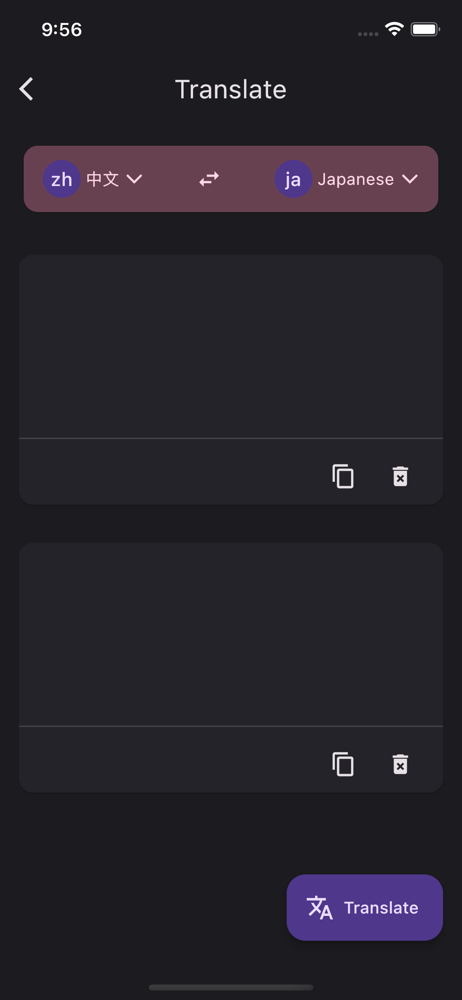
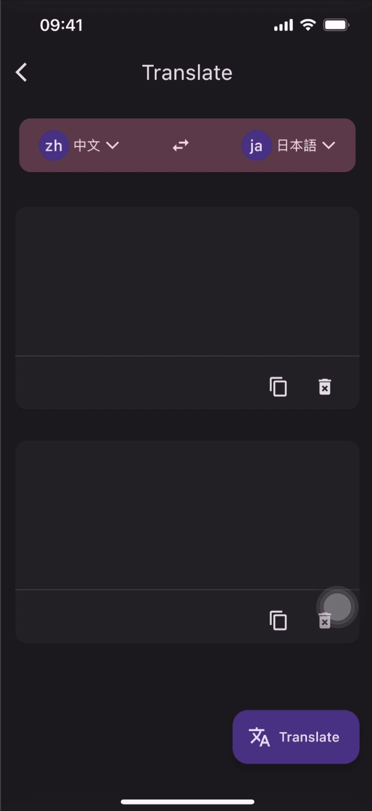

## 翻译

前面介绍的聊天 API ，是可以进行翻译的，`message`字段对应的参数设置如下：

```text
 [{"role": "user", "content": 'Translate the following English text to French: hello'}] 
```

向 AI 发送这个聊天消息，即可以把 hello 翻译成法语。

还有一个 API 也可以翻译，使用`text-davinci-003`模型：

```
POST https://api.openai.com/v1/completions
```

`body`采用以下格式的JSON ：

```
{
          "model": "text-davinci-003",
          "prompt": "Translate the following 当前语言 text to 目标语言 : 翻译文本",
          "max_tokens": 300,
}
```

也可以采用更简单的`prompt`，不需要当前语言：

```
{
          "model": "text-davinci-003",
          "prompt": "Translate this into 目标语言 : 翻译文本",
          "max_tokens": 300,
 }
```

前面讲过了聊天 API 的使用，这里就使用新的 API 和新的模型和 [**ChatGPT**](https://link.juejin.cn/?target=https%3A%2F%2Fopenai.com%2Fblog%2Fchatgpt) 通信。

最终界面将如下所示：



翻译的 UI 分为五部分：

- 标题栏。

- 翻译语言。

- 输入框：接收用户输入并发送到 ChatGPT API。

- 显示框：接收ChatGPT API 返回的翻译。

- 翻译按钮

布局都是基本控件的使用，`Card`、`PopupMenuButton`等，比较简。状态管理为了实现局部刷新，使用了`obs`，下面贴下请求的代码：

```
Future<String> translate(String text, String language) async {
  // 发起网络请求，使用post方法，并指定请求体的data参数为jsonEncode后的Map对象
  var result = await post('/completions',
      data: jsonEncode({
        "model": "text-davinci-003",
        "prompt": "Translate the following Chinese text to $language : $text",
        "max_tokens": 300,
      }),
      decodeType: ChatModel());
  var msg = '';
  // 处理请求结果
  result.when(
    success: (model) {
      // 遍历返回的ChatModel对象的choices列表，拼接文本
      model.choices?.forEach((element) {
        if (element.text?.isNotEmpty ?? false) {
          msg += element.text!;
        }
      });
    },
    failure: (msg, __) {
      // 请求失败时，弹出错误提示
      EasyLoading.showToast(msg);
    },
  );
  return msg.trim(); // 返回处理后的文本
}
```


下面是效果：




## 生成图片

点击首页标题栏的第二个 Action ，会跳转到生成图片页面，默认有一个图片展示。


UI 部分：

- 标题栏。

- 输入框。

- 画廊：展示 ChatGPT API 返回的图片。

  这里自定义了一个画廊，可以触摸展开和折叠，并且带有动画效果，动画控制器：

  ```
  _controller = AnimationController(
    vsync: this,
    duration: const Duration(milliseconds: 700),
  );
  final CurvedAnimation curve =
      CurvedAnimation(parent: _controller, curve: Curves.easeInOut);
  _animation = Tween(begin: 0.0, end: 1.0).animate(curve);
  ```

  点击的时候，如果是展开的状态，就折叠，反之展开，根据动画进度去计算宽度：

  ```
  class AnimatedCardItem extends StatefulWidget {
    final String image;
    final Animation<double> animation;
    final bool isExpanded;
    final VoidCallback onTap;
  
    const AnimatedCardItem({
      Key? key, // 使用Key?类型
      required this.image,
      required this.animation,
      required this.isExpanded,
      required this.onTap,
    }) : super(key: key); // 使用super关键字
  
    @override
    State<AnimatedCardItem> createState() => _AnimatedCardItemState();
  }
  
  class _AnimatedCardItemState extends State<AnimatedCardItem> {
    static const double collapsedWidth = 70; // 将常量提取到类成员变量中
    late double screenWidth; // 将Get.size.width提取到类成员变量中
  
    @override
    void initState() {
      super.initState();
      screenWidth = Get.size.width * 0.5; // 初始化屏幕宽度
    }
  
    @override
    void didUpdateWidget(covariant AnimatedCardItem oldWidget) {
      super.didUpdateWidget(oldWidget);
    }
  
    @override
    Widget build(BuildContext context) {
      return GestureDetector(
        onTap: widget.onTap,
        child: AnimatedBuilder(
          animation: widget.animation,
          builder: (context, child) {
            double value =
            widget.isExpanded ? widget.animation.value : 1 - widget.animation.value;
            return Container(
              width: collapsedWidth + value * screenWidth,
              clipBehavior: Clip.antiAlias,
              decoration: BoxDecoration(
                color: Theme.of(context).cardColor,
                borderRadius: BorderRadius.circular(collapsedWidth / 2),
              ),
              child: Image(
                image: NetworkImage(widget.image),
                fit: BoxFit.cover,
              ),
            );
          },
        ),
      );
    }
  }
  ```

每次请求4张256分辨率的图片：

```
var result = await post('/images/generations',
    data: jsonEncode({
      "prompt": message,
      "n": 4,
      "size": "256x256",
    }),
    decodeType: ImageModel());
```

下面是效果：


## 浅色模式

除了上面的功能，这个 app 按照 Material 3 设计，包含浅色模式和深色模式，可以根据系统改变：

